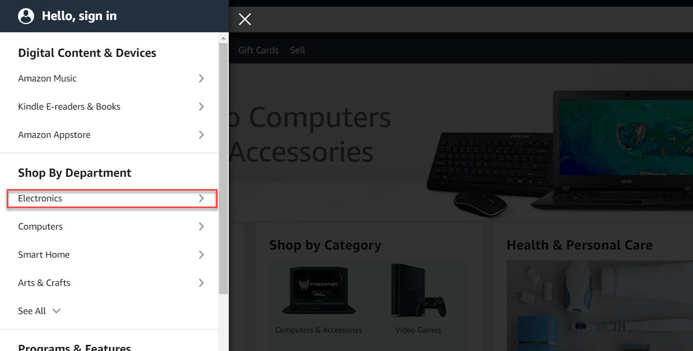
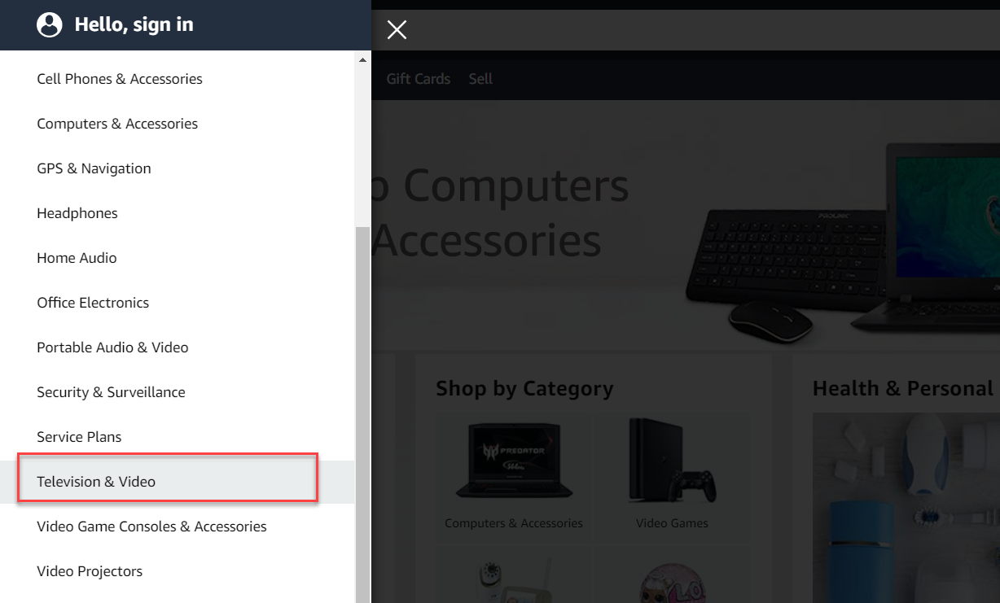
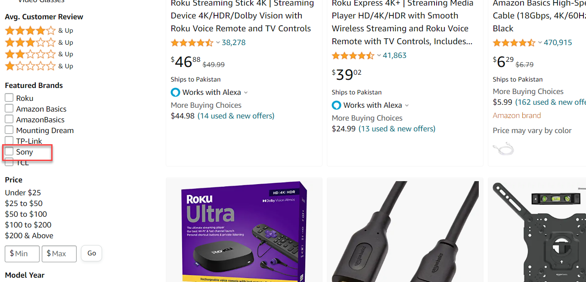

# Important Note
Few steps of assignment have been changed as Amazon.in was not showing
products of india in Pakistan rather was showing the products in pakistan,So I tested on URL (amazon.com) and following changes in assignment steps have occurred.
## Assignment
Web Automation: [Amazon](https://www.amazon.com/)
## Steps

1. Open <https://www.amazon.com/>.
2. Click on the `hamburger menu` in the top left corner.
3. Scroll own and then Click on the `Electronics` link under `Shop by Department` section.

4. Then click on `Televisions` under `Televion and Video` sub section.

5. Scroll down and filter the results by Brand ‘Sony’.
 
6. Sort the Samsung results with price High to Low.
7. Click on the second highest priced item (whatever that maybe at the time of automating).
8. Switch the Window
9. Assert that  “About this item” section is present and log this section text to console/report.

## Required External dependencies
For this project to run, you would need to install below 3 dependencies on your machine:

1. Java 11 (as the core programming language)
2. Maven 3.8.1 (for dependency management)
3. Google Chrome latest version (browser to run your tests)

## Things Implemented in the Project

1. Page object model has been implemented
2. Page Factory pattern has been implemented for locators
3. Singleton design pattern has been implemented for single driver creation
4. Utilities classes have been created separately
5. Proper document for each class and function has been added which will be shown on hover on function
6. Things implemented in this framework are as per current requirement but it canbe enhanced to add more features

## Future Considerations

1. Implement BDD with selenium for data layaer
2. Enable parallel execution
3. Enable multi browser configurations

## Steps to Execute

1. Import/Open the project in intelliJ or any other IDE or Clone the project from "https://github.com/zeeshan708/clipboard-health-assignment.git"
2. Build project to install all maven dependencies
3. Run command "mvn clean verify" in terminal or directly run test class

